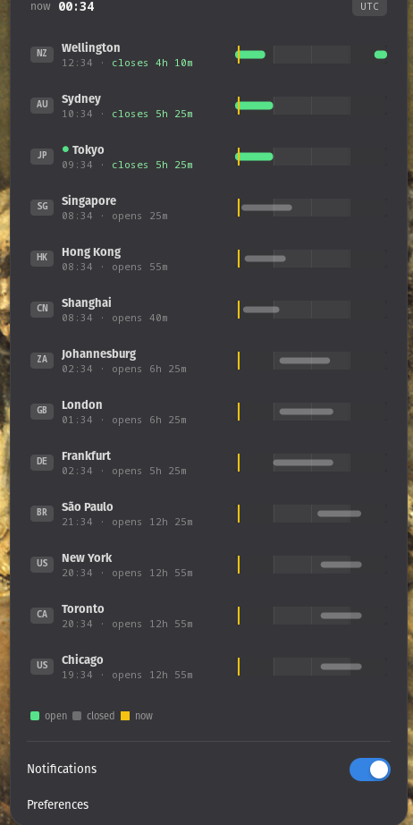
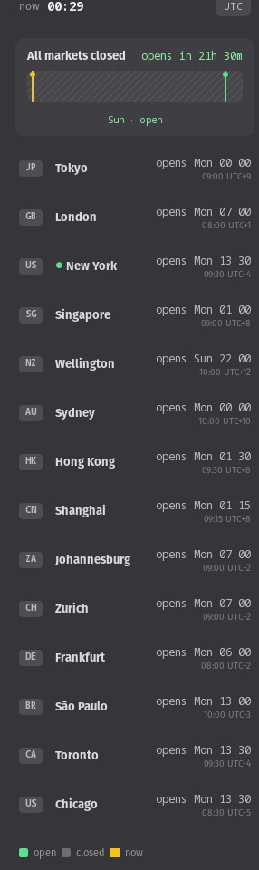
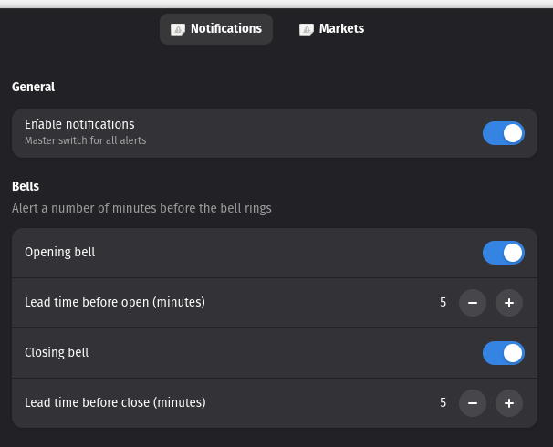
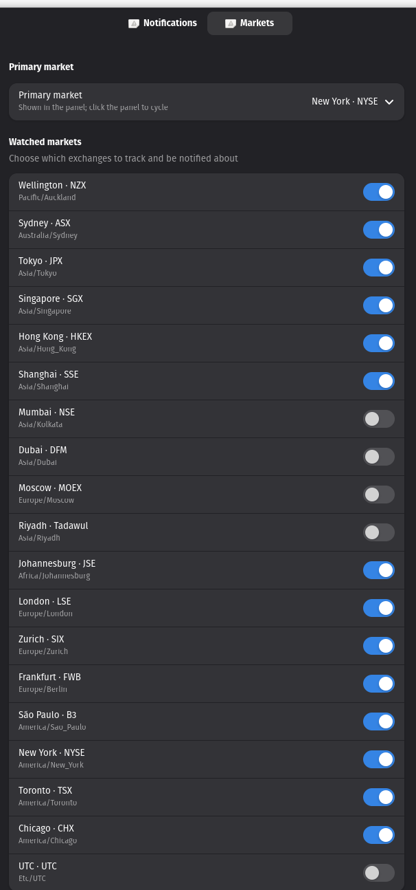

# MarketBell

A GNOME Shell extension that rings the bell for global markets. It puts a small
indicator in your top panel showing your **primary market's** next-bell
countdown, opens a **session-timeline popup** for every watched exchange, and
sends a desktop notification a configurable number of minutes before each
**opening** and **closing bell**.

It tracks **19 exchanges** across every major time zone, is fully **offline**
(all timezone, weekend and holiday logic runs locally — no network, no API
keys), and stays idle until something is about to happen.

<p align="center">
  
  &nbsp;&nbsp;
  
</p>

> MarketBell is the desktop-native sibling of the
> [`market_clock`](https://github.com/dgnsrekt/market_clock) service: it reuses
> the same market dataset and holiday calendars, but replaces the FastAPI +
> Redis + Slack stack with the GNOME panel and the system message tray.

## Features

- **Panel indicator** — clock icon + your **primary market's** next-bell
  countdown (`NYSE closes 1h 12m` in green when open, `NYSE opens 6h` dimmed when
  closed). Click the panel (or scroll) to cycle the primary through your watched
  markets; right-click opens the popup.
- **Session-timeline popup** — each watched market gets a 24-hour track with a
  green open-session bar, and a shared amber **now-line** crosses every row so
  "who closes next" reads at a glance. When everything's shut, a day-cell banner
  counts down to the next opening bell. Country-code chips, primary marked `●`.
- **Opening / closing bell notifications** with independent per-event lead times.
- **Holiday- and weekend-aware**, including the Gulf Friday–Saturday weekend
  (Dubai, Riyadh).
- **No duplicate alerts** — each bell fires once per day and survives a Shell
  restart.
- **Quick toggle** for notifications from the popup, full settings in a
  libadwaita preferences window.

## Supported GNOME versions

GNOME Shell **50** (ESM extensions; libadwaita preferences).

## Install (from source)

```sh
cd marketbell
make install      # copies to ~/.local/share/gnome-shell/extensions + compiles schema
```

Then restart GNOME Shell (log out / log in on Wayland, or `Alt+F2` → `r` on Xorg)
and enable it:

```sh
gnome-extensions enable marketbell@dgnsrekt.github.io
```

Open settings with `gnome-extensions prefs marketbell@dgnsrekt.github.io` —
choose your primary market, pick which of the 19 exchanges to watch, and set
per-bell notification lead times.

<p align="center">
  
  &nbsp;
  
</p>

## Packaging

```sh
make pack         # produces marketbell@dgnsrekt.github.io.shell-extension.zip
```

## Project layout

```
marketbell/
├── metadata.json        # uuid, shell-version, schema + gettext domain
├── extension.js         # enable()/disable() lifecycle only
├── prefs.js             # libadwaita preferences (no Shell imports)
├── stylesheet.css
├── schemas/             # GSettings schema
└── lib/
    ├── markets.js       # the 19 markets (ported from market_clock/regions.py)
    ├── holidays.js      # per-market 2026 holiday calendars (ISO YYYY-MM-DD)
    ├── marketclock.js   # pure, offline state engine (GLib time math)
    ├── scheduler.js     # single-timer plan/fire/re-arm loop
    ├── indicator.js     # panel button + popup
    └── notifier.js      # message-tray wrapper
```

## Updating holidays

`lib/holidays.js` lists each market's full-day closures as explicit
`YYYY-MM-DD` dates. Because the year is part of every entry, the engine simply
never matches dates from other years, so an out-of-date calendar can't mismatch
by a year — but it **does** need refreshing: once a year has passed, those
markets fall back to weekend-only logic.

Refresh annually from each exchange's official calendar. Note the two failure
directions if you let it go stale: a **missing** real holiday makes the market
look open (MarketBell may ring a bell on a closed day), and once a year rolls
over, none of the prior year's dates apply. The Islamic-calendar markets (Dubai,
Riyadh) also shift with moon sighting and should be re-checked close to the date.

Current data: **2026**, sourced from official exchange calendars.

## Roadmap

- Session-overlap alerts (e.g. London/New York peak-liquidity window).
- Midday lunch-break notifications for Asian markets.
- Pre-holiday warnings and an optional daily "today's opens" summary.
- Quiet hours and Do-Not-Disturb awareness.

See [`SPEC.md`](SPEC.md) for the full design.

## License

GPL-2.0-or-later.
